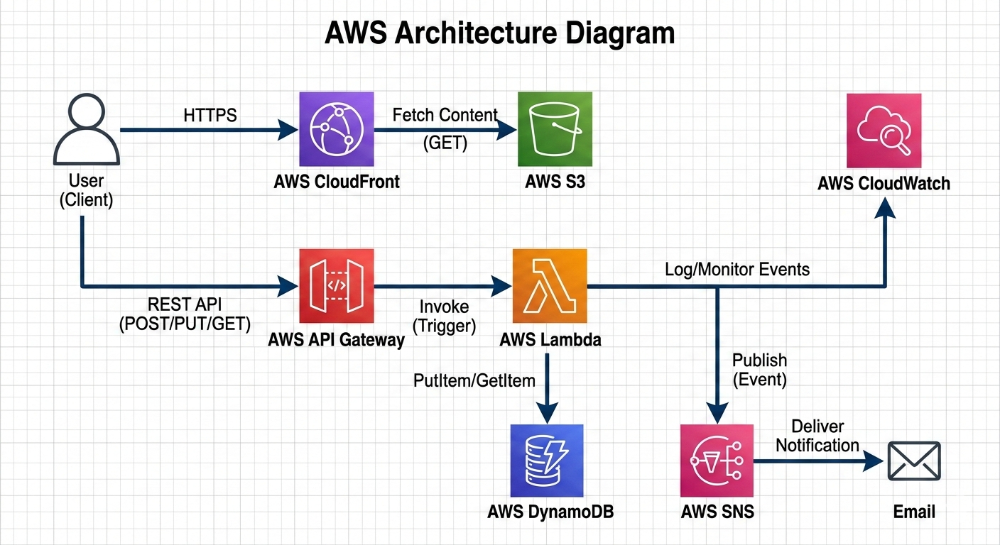

# 🚀 AWS Job Application Tracker

A fully serverless, secure job application tracking web app built entirely using the **AWS Management Console** — no CLI, no Terraform.

Built as a hands-on project while preparing for the **AWS Solutions Architect Associate (SAA-C03)** certification.

---

## 🏗️ Architecture

---

## ☁️ AWS Services Used

| Service | Purpose | SAA-C03 Domain |
|---|---|---|
| S3 | Private frontend hosting with versioning | Resilient Architectures |
| CloudFront | CDN with OAC + WAF + HTTPS enforcement | Secure Architectures |
| API Gateway | REST API (GET + POST endpoints) | High-Performing Architectures |
| Lambda (Python) | Serverless business logic | Cost-Optimized Architectures |
| DynamoDB | NoSQL database with GSI for status queries | High-Performing Architectures |
| SNS | Email alerts on Interview/Offer status | Event-Driven Architectures |
| CloudWatch | Dashboard + alarms for observability | Operational Excellence |
| IAM | Least-privilege roles for Lambda | Secure Architectures |
| VPC | Custom VPC with public/private subnets across 2 AZs | Resilient Architectures |

---

## 🔐 Security Design Decisions

- **S3 bucket is fully private** — served only through CloudFront using Origin Access Control (OAC), the modern replacement for OAI
- **WAF enabled** on CloudFront distribution at no additional cost — protects against common web vulnerabilities
- **HTTPS enforced** — HTTP automatically redirects to HTTPS via CloudFront viewer protocol policy
- **IAM least-privilege** — Lambda has a dedicated role with only DynamoDB + SNS + CloudWatch Logs permissions
- **No credentials hardcoded** — all AWS service access via IAM roles

---

## 🌐 Network Design

VPC: 10.0.0.0/16 (us-east-1)
├── public-subnet-1a: 10.0.1.0/24 (us-east-1a)
├── public-subnet-1b: 10.0.2.0/24 (us-east-1b)
├── private-subnet-1a: 10.0.3.0/24 (us-east-1a)
└── private-subnet-1b: 10.0.4.0/24 (us-east-1b)

- Internet Gateway attached to public subnets
- Separate route tables for public vs private traffic
- Multi-AZ design for high availability

---

## 📊 Observability

- **CloudWatch Dashboard** — Lambda invocations, errors, API Gateway latency, DynamoDB performance
- **Lambda Error Alarm** — triggers SNS email if errors exceed 2 in 5 minutes
- **API Gateway 5XX Alarm** — triggers SNS email on server-side errors

---

## ⚡ Features

- ✅ Add job applications (Company, Title, Status, Date, Notes)
- ✅ View all applications live from DynamoDB
- ✅ Color-coded status badges (Applied, Interview, Offer, Rejected)
- ✅ Automatic email alert when status is Interview or Offer
- ✅ Applications sorted by date (newest first)

---

## 💰 Cost

**$0/month** — 100% within AWS Free Tier:
- CloudFront: 1TB transfer + 10M requests/month (permanent free)
- Lambda: 1M requests/month (permanent free)
- DynamoDB: 25GB + 25 RCU/WCU (permanent free)
- S3: 5GB storage (12 months free)
- SNS: 1M publishes/month (permanent free)

---

## 📸 Screenshots

## 📸 Screenshots

### Live Site

### CloudWatch Dashboard

### DynamoDB Table

### SNS Email Alert

---

## 🧠 What I Learned

- How to serve a private S3 bucket securely through CloudFront using OAC
- Designing a multi-AZ VPC with proper public/private subnet separation
- Building event-driven architecture with Lambda → SNS triggers
- Using DynamoDB GSI for flexible query patterns beyond the primary key
- Setting up CloudWatch observability across a multi-service serverless stack

---

## 👨‍💻 Author

**Syed Absar Burney** | AWS Solutions Architect Associate (In Progress)

